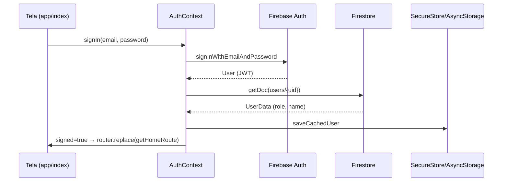
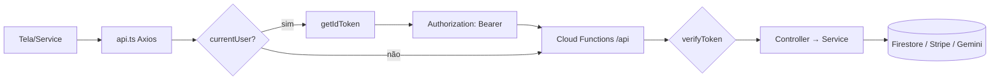
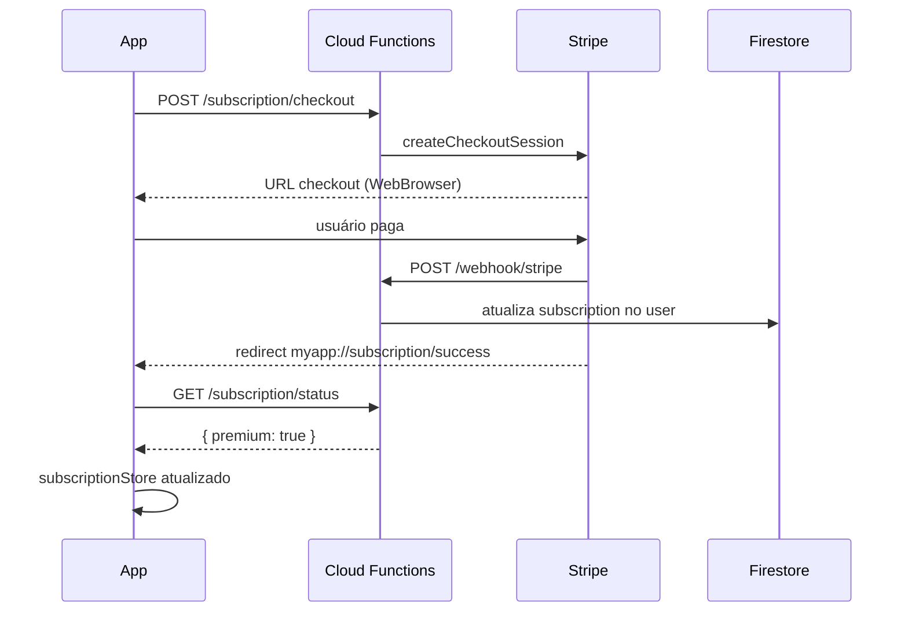
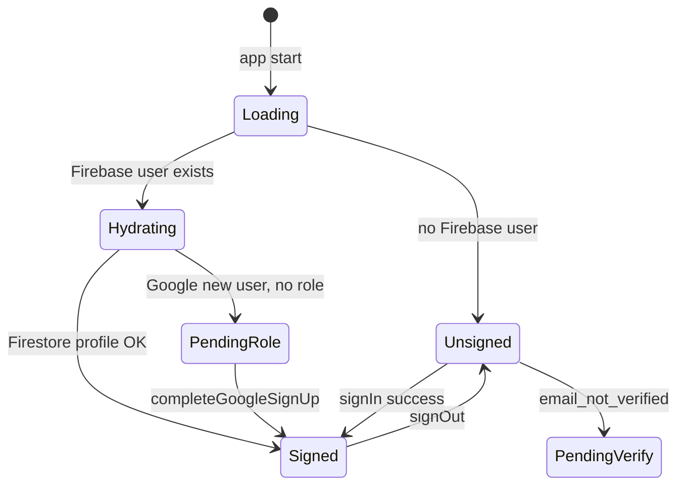

# Fluxos de Dados

## Sumário

- [Autenticação](#autenticação)
- [Navegação pós-login](#navegação-pós-login)
- [Chamadas à API](#chamadas-à-api)
- [Geração de dieta](#geração-de-dieta)
- [Assinatura Premium (Stripe)](#assinatura-premium-stripe)
- [Persistência local](#persistência-local)
- [Notificações push](#notificações-push)
- [Mensagens paciente ↔ nutricionista](#mensagens-paciente--nutricionista)
- [Diagrama de estados (auth)](#diagrama-de-estados-auth)
- [⚠️ Observações](#️-observações)

---

## Autenticação

### E-mail e senha



**Verificação de e-mail:** se `emailVerified === false`, retorno `email_not_verified`; UI exibe opção de reenvio via `auth.service` → `POST /auth/resend-verification`.

### Google Sign-In

1. `signInWithGoogle()` → `googleAuth.ts` → credential Firebase
2. Se usuário novo sem `role` em Firestore → onboarding em `/generate` (`completeGoogleSignUp`)
3. `saveUserRole(role)` grava documento `users/{uid}`

### Logout

`signOut()` → Firebase `signOut` → `clearCachedUser` → `router.replace("/")`.

---

## Navegação pós-login

```
app/index.tsx (login)
    ↓ signed + role
getHomeRoute(role)
    ├── patient  → /patient/home
    └── nutritionist → /professional/home

RoleRouteGuard (em cada grupo)
    ├── role correto → renderiza Stack filho
    └── role incorreto → Redirect getHomeRoute
```

Telas compartilhadas em `(shared)/`: conta, assinatura, geração de dieta, signup.

---

## Chamadas à API



**Base URL:** `resolveApiBaseUrl()` — env ou `app.json` extra.

**Timeout:** 60s (`api.ts`).

**Retry 401:** até 2 tentativas em rotas `/subscription/*` (delay 1s).

---

## Geração de dieta

### Fluxo paciente (autônomo)

1. Tela `(shared)/generate` ou fluxo `consultation → create`
2. `dietGenerationService.ts` monta payload clínico
3. `POST /create` com token + (opcional) App Check
4. Backend: `CreateNutritionController` → `CreateNutritionService` → Gemini API
5. Resposta salva em Firestore (`users/{uid}/diets` ou coleção de paciente)
6. Navegação para rota de plano (`getDietPlanRoute(role)`)

### Regras de acesso

- `checkDietGenerationAccess` — limite plano gratuito (`FREE_PLAN_LIMIT` em functions)
- Paciente vinculado a nutricionista pode ter geração bloqueada (`assertPatientNotUnderNutritionistReadOnly`)
- `POST /regenerate` exige Premium (`checkPremium`)

---

## Assinatura Premium (Stripe)



**Deep link:** `GET /subscription/checkout-done` redireciona para `myapp://subscription/success?session_id=...`.

**Client:** `@stripe/stripe-react-native` + `stripe.service.ts`.

**Estado:** `subscriptionStore` (Zustand) + hook `useSubscription`.

---

## Persistência local

| Dado | Mecanismo | Chave / local |
|------|-----------|---------------|
| Perfil do usuário | SecureStore (native) / AsyncStorage (web) | `dietos.user.profile` |
| Idioma | AsyncStorage | `@dietLanguage` |
| Lembretes de refeição | AsyncStorage | `@dietMealReminders` |
| Paciente selecionado | Zustand (memória) | `patientStore` |
| Status Premium | Zustand (memória, refetch API) | `subscriptionStore` |
| Auth Firebase | AsyncStorage via persistence RN | automático |

**Hidratação offline parcial:** `loadCachedUser()` na tela de login acelera exibição; fonte de verdade continua sendo Firestore após `onAuthStateChanged`.

---

## Notificações push

### Lembretes de refeição

1. `reminder.service.ts` agenda notificações locais via `expo-notifications`
2. Metadados persistidos em AsyncStorage (`StoredMealReminder`)
3. Android: canal `meal-reminders`

### Mensagens de contato

1. `ContactMessagePushBootstrap` em `_layout.tsx` registra token após login
2. `PUT /contact/nutritionist/push-token` grava token no Firestore
3. Backend `ContactPushService` envia via Expo Push API

**Limitação documentada no código:** notificações Android não funcionam no Expo Go (`notificationsRuntime.ts`).

---

## Mensagens paciente ↔ nutricionista

```
Paciente → POST /contact/nutritionist
Nutricionista → GET /contact/nutritionist/messages
              → GET .../patients/:patientUid/messages
              → POST .../messages/:messageId/reply
```

Dados em Firestore; leitura/escrita mediada pela API (não direto do client para threads sensíveis).

---

## Vínculo paciente ↔ nutricionista

```
Nutricionista → POST /patients/link-request
Paciente → GET /patients/link-requests
         → POST /patients/link-request/accept | reject
```

`PatientLinkService` atualiza `linkedAppUserId` no documento do paciente.

---

## Diagrama de estados (auth)



---

## ⚠️ Observações

- Não há cache estruturado de respostas API (sem React Query cache amplo, sem SQLite/MMKV).
- App Check desativado no client — requests vão sem header `X-Firebase-AppCheck` (código comentado).
- `TanStack Query` usado principalmente em `(shared)/diet-plan/index.tsx`; demais telas usam `useState` + `useEffect` + services.
