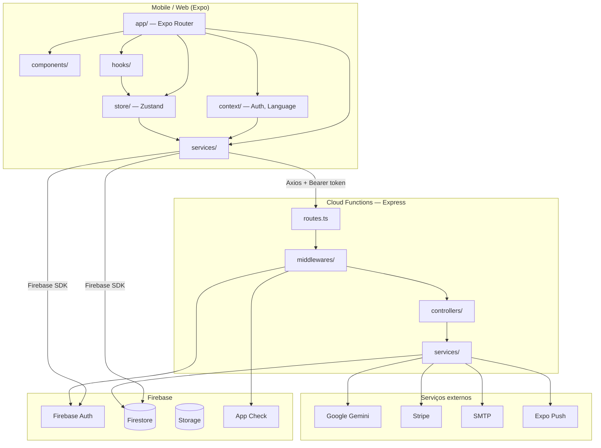

# System Design

## Sumário

- [Visão geral](#visão-geral)
- [Diagrama de arquitetura](#diagrama-de-arquitetura)
- [Camadas e módulos](#camadas-e-módulos)
- [Backend (Cloud Functions)](#backend-cloud-functions)
- [Roteamento mobile](#roteamento-mobile)
- [Modelo de dados (domínio)](#modelo-de-dados-domínio)
- [Segurança](#segurança)
- [⚠️ Observações](#️-observações)

---

## Visão geral

| Aspecto | Detalhe |
|---------|---------|
| **Propósito** | App de nutrição com geração de dietas por IA, gestão de pacientes e monetização Premium |
| **Público-alvo** | Pacientes e nutricionistas (profissionais de saúde) |
| **Plataformas** | Android (primário), iOS, Web (parcial) |
| **Padrão arquitetural** | Híbrido **feature-based** (rotas por papel) + **camadas** (UI → context/store → services → Firebase/API) |
| **Backend** | Monolito Express em Firebase Functions v2, região `southamerica-east1` |

---

## Diagrama de arquitetura



### Fluxo simplificado (ASCII)

```
[Tela] → [Context/Store/Hook] → [Service] → Firestore (leitura direta)
                                          → Axios → Cloud Functions → Firestore/Stripe/Gemini
```

---

## Camadas e módulos

### `app/` — Apresentação e navegação

File-based routing via Expo Router. Grupos de rota por papel:

| Grupo | Responsabilidade |
|-------|------------------|
| `(patient)/` | Fluxo do paciente (home, consulta, dieta, ferramentas) |
| `(professional)/` | Fluxo do nutricionista (pacientes, dietas, mensagens) |
| `(shared)/` | Telas compartilhadas (login adjacente, signup, conta, assinatura, geração) |
| `_layout.tsx` | Root layout: `SafeAreaProvider`, `LanguageProvider`, `AuthProvider`, `QueryClientProvider`, `Stack`, Toast |

**Guards:** `RoleRouteGuard` em `(patient)/_layout.tsx` e `(professional)/_layout.tsx` redireciona usuários com papel incorreto.

### `components/` — UI reutilizável

17 componentes: inputs, botões, listas de pacientes/dietas, gráficos de progresso, guards (`PremiumGuard`, `RoleRouteGuard`), shell de dashboard.

### `context/` — Estado global React

| Context | Responsabilidade |
|---------|------------------|
| `auth.tsx` | Sessão Firebase, perfil Firestore, sign-in/up, Google, cache local |
| `language.tsx` | i18n pt/en, persistência em AsyncStorage |

### `store/` — Estado Zustand

| Store | Responsabilidade |
|-------|------------------|
| `patientStore.ts` | Paciente selecionado pelo nutricionista |
| `subscriptionStore.ts` | Status Premium via API Stripe |
| `data.ts` | Tipos auxiliares legados |

### `hooks/`

| Hook | Responsabilidade |
|------|------------------|
| `useSubscription.ts` | Encapsula `subscriptionStore` + flag dev premium |
| `useLinkedNutritionistCare.ts` | Verifica vínculo paciente ↔ nutricionista |

### `services/` — Integrações

Camada que encapsula Firebase, HTTP e lógica de domínio no client:

- `api.ts` — Axios com interceptor de token Firebase e retry 401
- `firebase.ts` — Inicialização Firebase Auth (persistência AsyncStorage) + Firestore
- `dietGenerationService.ts` — Orquestra geração de dieta (API + Firestore)
- `stripe.service.ts` — Checkout e status de assinatura
- `reminder.service.ts` — Lembretes locais via `expo-notifications`
- `auth.service.ts`, `googleAuth.ts` — Autenticação
- Demais: check-in, diário, body metrics, patient link, favoritos, notificações de contato

### `utils/`

Funções puras: i18n, rotas por papel (`roleRoutes.ts`), export PDF, feature flags, formatação, analytics de dieta.

### `constants/colors.ts`

Paleta de cores fixa (tema escuro). Não há design system completo (spacing, typography tokens).

---

## Backend (Cloud Functions)

### Bootstrap

```
server.ts → onRequest (Firebase v2) → createApp() → Express
```

`createApp.ts`:
1. Rota raw `/webhook/stripe` (antes do `express.json`)
2. CORS configurável (`CORS_ALLOWED_ORIGINS`)
3. Monta `routes.ts`
4. Error handler global

### Estrutura interna

| Pasta | Responsabilidade |
|-------|------------------|
| `controllers/` | Handlers HTTP (Auth, Stripe, Nutrition, Contact, PatientLink, Site) |
| `services/` | Lógica de negócio, acesso Firestore, integrações |
| `middlewares/` | `verifyToken`, `verifyAppCheck`, `checkPremium`, rate limits |
| `config/` | Firebase Admin, Stripe, superuser |
| `utils/` | Logs, sanitização LLM, locale Stripe |

### Endpoints principais (`routes.ts`)

| Rota | Middlewares | Função |
|------|-------------|--------|
| `POST /create` | token, appCheck, rateLimit, dietAccess | Gerar dieta (IA) |
| `POST /regenerate` | token, appCheck, rateLimit, premium | Regenerar dieta |
| `POST /auth/*` | rate limits | Forgot password, resend verification |
| `POST /contact/nutritionist/*` | token, appCheck | Mensagens paciente ↔ nutri |
| `POST /patients/link-request/*` | token, appCheck | Vínculo paciente-nutricionista |
| `POST /subscription/*` | token, appCheck | Stripe checkout, status, cancel |
| `POST /webhook/stripe` | raw body | Webhooks Stripe |
| `GET /subscription/checkout-done` | — | Redirect deep link pós-checkout |

---

## Roteamento mobile

Mapa de rotas por papel (`utils/roleRoutes.ts`):

```typescript
// Paciente
/patient/home, /patient/consultation, /patient/create,
/patient/diet-plan, /patient/edit

// Nutricionista
/professional/home, /professional/patient, /professional/create,
/professional/diet-plan, /professional/patient-diets, /professional/patient-edit
```

Home padrão pós-login: `getHomeRoute(role)` → `/patient/home` ou `/professional/home`.

Usuário sem papel definido: redirecionado para `/generate`.

---

## Modelo de dados (domínio)

Tipos centrais em `types/data.ts`:

| Entidade | Campos relevantes |
|----------|-------------------|
| `UserData` | id, email, name, role (`patient` \| `nutritionist`) |
| `Patient` | dados clínicos, vínculo `linkedAppUserId` |
| `Data` | plano alimentar (refeições, orientações, exames) |
| `DietCheckIn` | aderência, fome, energia, humor |
| `FavoriteDiet` | template reutilizável do nutricionista |

Persistência:
- **Firestore** — fonte de verdade (users, patients, diets, messages, subscriptions)
- **AsyncStorage / SecureStore** — cache de perfil (`userStorage.ts`), idioma, lembretes
- **Zustand** — estado em memória (paciente selecionado, subscription)

---

## Segurança

| Camada | Mecanismo |
|--------|-----------|
| Firestore rules | `firestore.rules` — testado em `tests/firestore.rules.test.cjs` |
| Storage rules | `storage.rules` |
| API | Bearer JWT Firebase + verificação de e-mail |
| Premium | `checkPremium` / `AccessPolicyService` |
| Rate limiting | Por rota (`rateLimit.ts`) |
| App Check | Middleware `verifyAppCheck` (enforcement via `APP_CHECK_ENFORCE`) |
| CORS | Lista explícita de origens em `createApp.ts` |

---

## ⚠️ Observações

- Não há camada Repository formal — services acessam Firestore diretamente.
- `firebase-functions` aparece como dependência tanto na raiz (^4.9.0) quanto em `functions/` (^7.2.5); apenas `functions/` usa o pacote em runtime.
- Design visual: `StyleSheet` inline e `constants/colors.ts`; sem biblioteca de componentes (Paper, Tamagui, NativeWind).
- `userInterfaceStyle: "automatic"` no `app.json`, mas UI usa cores escuras fixas sem `useColorScheme`.
